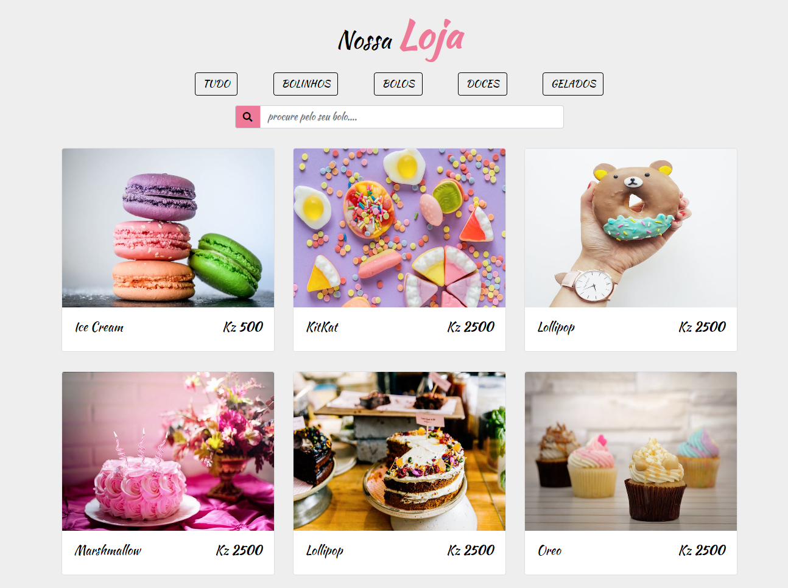

# Dom Martins - Loja de doces 🥞🥞

"Dom Martins" é uma pequena aplicação que está sendo construído com  [Vue.js](https://vuejs.org/v2/guide/) com a finalidade de treinar os meus conhecimentos em Vue.js.

### Screenshots

## Instalação

Para rodar essa aplicação é simples. É só fazeres o clone deste repositório e abrires apartir do seu localhost.

## Contribuindo

Esse é um projeto livre e você pode contribuir com qualquer coisa: Melhorando o readme, aplicando novas funcionalidades e etc....

### Obs: Faça os commits e os testes antes do pull request.